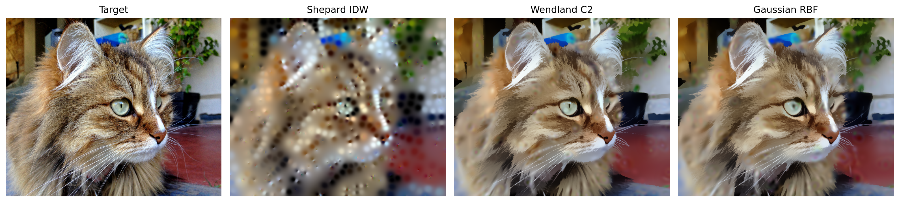
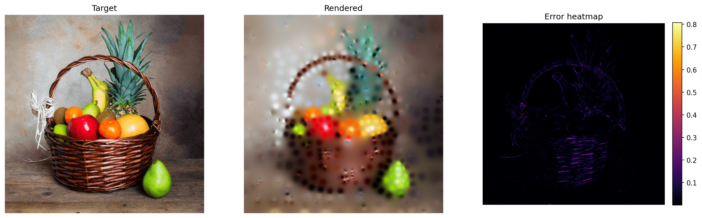
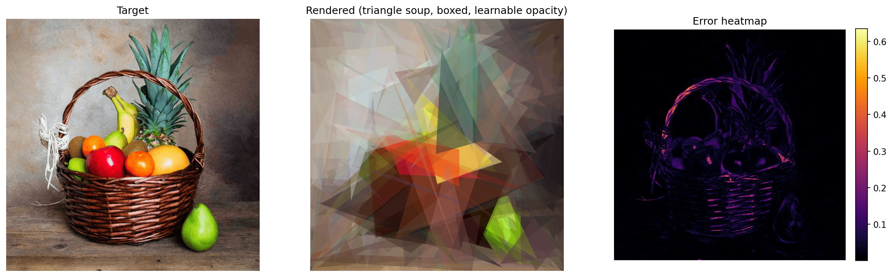
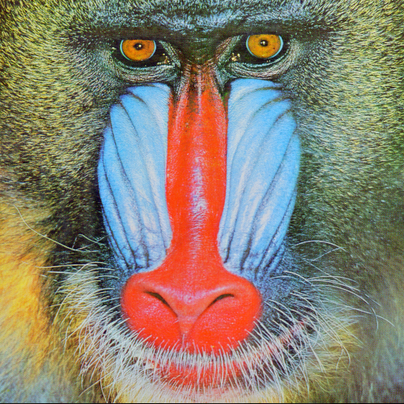

# diffvg (fork) — Comparative Analysis of Geometric Primitives for Differentiable Image Reconstruction



This is a fork of [diffvg](https://people.csail.mit.edu/tzumao/diffvg/), a differentiable rasterizer for 2D vector graphics. This fork extends diffvg with several additional kernel-based primitives and investigates which geometric representation offers the best trade-off between reconstruction fidelity, geometric complexity, and convergence speed, for the task of reconstructing raster (pixel) images.

This project was completed as part of an NSERC USRA at Carleton University's Graphics, Imaging, and Games Lab (GIGL), supervised by Dr. David Mould and Dr. Oliver van Kaick.

## What's different in this fork

The original diffvg supports circles, ellipses, rectangles, polygons, curves, and paths, optimized against a target image via gradient descent through a differentiable rasterizer.

This fork adds five additional primitive types, each implemented as its own C++ kernel added onto the diffvg pipeline, and compares them against each other on image reconstruction tasks:

- **Splatting kernels** — three variants, each a smooth radial falloff around a control point:
  - **Wendland C2** — compact-support polynomial kernel, `(1-t)^4(4t+1)` (`wendland` branch)
  - **Gaussian RBF** — standard Gaussian falloff, `exp(-t^2 / 2*sigma^2)` (`gaussian` branch)
  - **Shepard IDW** — inverse-distance-weighted global interpolation, `1/dist^q` (`shepard` branch)
- **Polynomial kernels** — per-primitive polynomial coefficient blending (see `poly` branch)
- **Triangle soups** — independent triangles, no shared vertices/edges, each with a flat colour and a learnable opacity, composited via soft-rasterized alpha-over compositing (`trianglesoup` branch)


Each kernel branch has both a plain O(N) renderer and a tile-grid accelerated ("boxed") variant that only evaluates primitives near each pixel, resulting in a faster reconstruction speed for a large
N. Comparison scripts (`comparison_*.py`) reconstruct a target image starting from a degraded/blurred version, computing SSIM and LPIPS against the sharp original.

*Instructions on how to run these scripts can be found below and inside the scripts themselves.*

### Example output


The **Wendland reconstruction** uses a compact-support polynomial kernel. Each control point influences only nearby pixels, producing a localized and smoothly blended reconstruction.

---


The **Gaussian reconstruction** uses Gaussian radial basis functions. Each control point contributes a smooth falloff that extends across the image, with influence decreasing gradually as distance increases.

---



The **Shepard reconstruction** uses inverse-distance weighting. Pixel values are interpolated from control points according to their distances, allowing contributions from points across the image.

---



The **Triangle Soup reconstruction** represents the image using independent triangles. Each triangle has its own geometry, colour, and learnable opacity, and the triangles are composited to form the final reconstruction.

## Branch structure

Each primitive lives on its own branch, built off diffvg's `master`:

| Branch | Primitive |
|---|---|
| `master` | Base diffvg (circles, ellipses, paths, etc.) |
| `wendland` | Wendland C2 splatting kernel |
| `gaussian` | Gaussian RBF splatting kernel |
| `shepard` | Shepard IDW global interpolation |
| `trianglesoup` | Independent triangle soup with learnable opacity |

## Requirements

Before installing, make sure you have the following set up on your system:

- **Git** (with submodule support)
- **Conda** (Miniconda or Anaconda) — used to manage the Python environment and dependencies
- **C++ compiler with C++14 support**
  - Linux/macOS: GCC or Clang
  - Windows: MSVC (via the x64 Native Tools Command Prompt)
- **CUDA Toolkit** (optional for GPU acceleration; CPU-only builds work but are significantly slower for large N)

## Install

```
git submodule update --init --recursive
conda create -n diffvg python=3.10
conda activate diffvg
conda install -y pytorch torchvision -c pytorch
conda install -y numpy
conda install -y scikit-image
conda install -y -c anaconda cmake
conda install -y -c conda-forge ffmpeg
conda install -y matplotlib
pip install svgwrite
pip install svgpathtools
pip install cssutils
pip install numba
pip install lpips
python setup.py install
```

You can check if diffvg is installed correctly by running `python -c "import pydiffvg"` in the conda environment. If there are no errors, the installation was successful.

**Rebuilding after switching branches:**
```
rm -rf build
python setup.py install
```

**Windows:** build from the x64 Native Tools Command Prompt with the conda environment
activated.

## Running a single primitive

```
cd apps
```

Each primitive has a standalone rendering script that fits N control points/shapes directly to a target image. All accept `--n`, `--iters`, and `--image` to override the defaults (N=1000, 200 iterations, `imgs/fruit_basket.png`) without editing the script:

```
python wendland_rendering_boxed.py --n 500 --iters 100 --image imgs/cat.png
python gaussian_rendering_boxed.py --n 500 --iters 100 --image imgs/cat.png
python shepard_rendering.py --n 500 --iters 100 --image imgs/cat.png
python trianglesoup_rendering_boxed.py --n 500 --iters 100 --image imgs/cat.png
```

`shepard_segmented.py` additionally takes `--seg-size` (Mean Shift bandwidth — smaller means more, finer segments):

```
python shepard_segmented.py --n 100 --iters 100 --image imgs/cat.png --seg-size 0.2
```

Each writes its outputs (final render, loss curve, error heatmap, timing, and several diagnostic visualizations) to `results/<script_name>/`. The boxed rendering scripts also run an optional **focus phase** after the main loop: a second round of iterations that reweights the loss toward pixels with the worst error from pass one, and reports whether that actually reduced error (`focus_summary.txt`) — this doesn't always help, and is itself a reportable per-primitive result.

### Running every primitive at once

`run_all_rendering.sh` runs all primitive scripts sequentially, switching branches automatically. `N`, `ITERS`, `IMAGE`, and `SEG_SIZE` are configurable via environment variables instead of editing the script:

```
chmod +x run_all_rendering.sh
N=500 ITERS=100 IMAGE=imgs/cat.png ./run_all_rendering.sh
```

## Running a comparison (degraded → sharp reconstruction)

The comparison scripts take a target (sharp) image and a degraded (blurred) image, and optimize the primitive's parameters to reconstruct the sharp image starting from the degraded one as the base canvas. They also accept `--n`/`--iters`:

```
python comparison_wendland_boxed.py --target imgs/level_0.png --degraded imgs/level_1.png --outdir results/comparison_wendland_boxed --n 1000 --iters 200
python comparison_gaussian_boxed.py --target imgs/level_0.png --degraded imgs/level_1.png --outdir results/comparison_gaussian_boxed --n 1000 --iters 200
python comparison_shepard.py --target imgs/level_0.png --degraded imgs/level_1.png --outdir results/comparison_shepard --n 1000 --iters 200
python comparison_trianglesoup_boxed.py --target imgs/level_0.png --degraded imgs/level_1.png --outdir results/comparison_trianglesoup_boxed --n 1000 --iters 200
```

Each comparison run outputs, among other things:
- `all_comparison.png` — degraded | degraded-error | original | reconstruction | reconstruction-error, on a shared error color scale
- `baseline_error.txt` / `focus_summary.txt` — quantitative error summaries
- `timing.txt` — forward/backward pass timing

### Running the full sweep

`run_all_comparisons.sh` runs all four primitives across a chain of degradation levels, checking out each branch automatically, scoring each hop's reconstruction against the sharp target as it goes, and running the full `score_results.py` summary at the end.
`N`, `ITERS`, and `IMAGE_SET` are configurable via environment variables — `IMAGE_SET` must match a folder under `imgs/` containing `level_0.png`..`level_4.png`, and results are written under `results/<IMAGE_SET>/...` to match:

```
chmod +x run_all_comparisons.sh
N=500 ITERS=100 IMAGE_SET=Cat ./run_all_comparisons.sh
```

You should set your PC to not sleep during this process (`caffeinate -i ./run_all_comparisons.sh` on macOS), as it can take several hours to complete all comparisons.

`score_results.py` also accepts `--image-set` if you want to (re-)score a specific set manually:
```
python score_results.py --image-set Cat
```
which reports SSIM/LPIPS pass/fail per primitive per hop, using thresholds `SSIM > 0.9` and `LPIPS < 0.1`, and writes a summary table to `results/<IMAGE_SET>/level_summary.txt`.

## Performance scaling (N vs. time)

Each primitive has an `n_vs_time_*.py` script that measures forward/backward render time across a sweep of N values, for comparing how each primitive's cost scales:

```
python n_vs_time_wendland.py --image imgs/cat.png --n-values 100,500,1000 --sleep 5
python n_vs_time_wendland_boxed.py --image imgs/cat.png --n-values 100,500,1000 --sleep 5
python n_vs_time_gaussian.py --image imgs/cat.png --n-values 100,500,1000 --sleep 5
python n_vs_time_gaussian_boxed.py --image imgs/cat.png --n-values 100,500,1000 --sleep 5
python n_vs_time_shepard.py --image imgs/cat.png --n-values 100,500,1000 --sleep 5
python n_vs_time_trianglesoup.py --image imgs/cat.png --n-values 100,500,1000 --sleep 5
python n_vs_time_trianglesoup_boxed.py --image imgs/cat.png --n-values 100,500,1000 --sleep 5
```

`--n-values` is a comma-separated list (default `50,100,250,500,750,1000,1500,2000,3000,4000,5000`). `--sleep` controls the cooldown (seconds) between each N value, to avoid thermal throttling skewing later measurements. Each script writes a `.txt` timing table and a
`.png` plot to `results/n_vs_time/`.

Run every primitive's sweep at once with `run_all_n_vs_time.sh`, which accepts `IMAGE`, `N_VALUES`, and `SLEEP` as environment variables:

```
chmod +x run_all_n_vs_time.sh
N_VALUES=100,500,1000 SLEEP=5 IMAGE=imgs/cat.png ./run_all_n_vs_time.sh
```

## Building in debug mode

```
python setup.py build --debug install
```

---

## More examples + command-line arguments
do this later
| Image 1 Title | Image 2 Title |
| ------------- | ------------- |
|  |  |

---

| Image 1 Title | Image 2 Title |
| ------------- | ------------- |
|  |  |

---

| Image 1 Title | Image 2 Title |
| ------------- | ------------- |
|  |  |

---

| Image 1 Title | Image 2 Title |
| ------------- | ------------- |
|  |  |

---

| Image 1 Title | Image 2 Title |
| ------------- | ------------- |
|  |  |

---

## Original diffvg

The base rasterizer and its original usage (single-shape optimization, painterly rendering, image vectorization, seam carving, generative models) is documented at [https://people.csail.mit.edu/tzumao/diffvg/](https://people.csail.mit.edu/tzumao/diffvg/). See `apps/` for the original example scripts (`single_circle.py`, `painterly_rendering.py`, `refine_svg.py`, `seam_carving.py`, etc.), which still work unmodified on the `master` branch.

If you use diffvg in your academic work, please cite the original paper:
```
@article{Li:2020:DVG,
    title = {Differentiable Vector Graphics Rasterization for Editing and Learning},
    author = {Li, Tzu-Mao and Luk\'{a}\v{c}, Michal and Gharbi Micha\"{e}l and Jonathan Ragan-Kelley},
    journal = {ACM Trans. Graph. (Proc. SIGGRAPH Asia)},
    volume = {39},
    number = {6},
    pages = {193:1--193:15},
    year = {2020}
}
```
